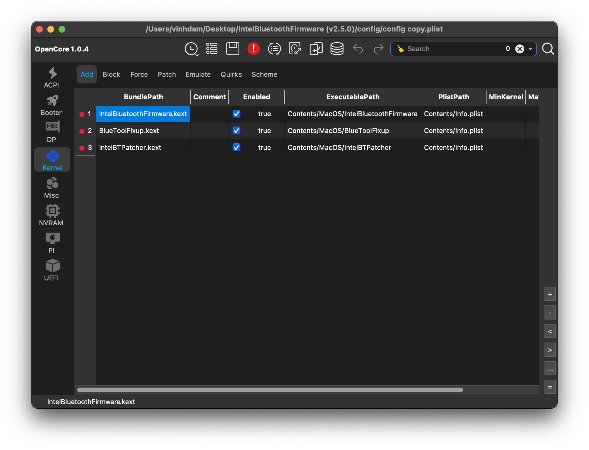
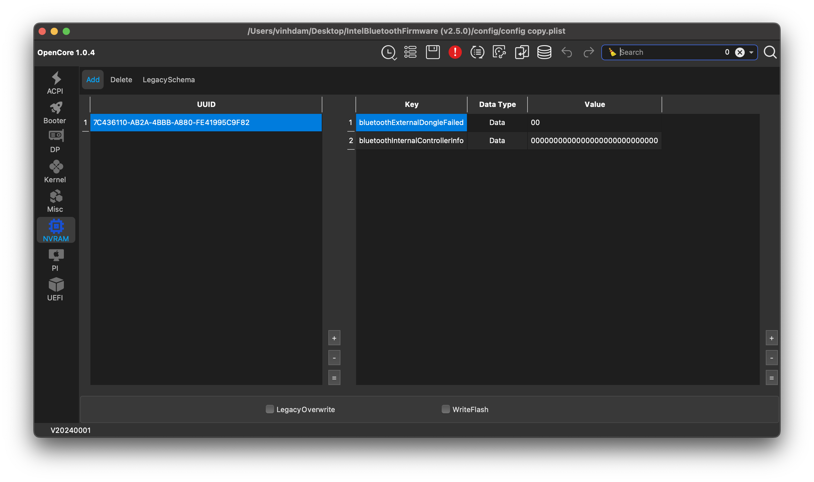
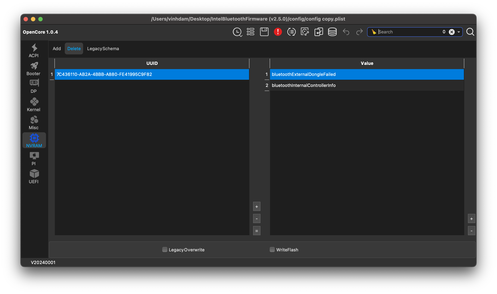

# 🔧 IntelBluetoothFirmware Kext (v2.5.0) – macOS Sequoia (15.x) Support

This guide explains how to configure **IntelBluetoothFirmware v2.5.0** for macOS Sequoia, including kext installation and NVRAM setup to enable Intel Bluetooth functionality.

---

## 1️⃣ Install Kexts into EFI

Copy the following **3 kexts** into the `EFI/OC/Kexts` folder and **snap** them into your `config.plist` using OpenCore Configurator, OCAuxiliaryTools or ProperTree:

- `IntelBluetoothFirmware.kext`
- `IntelBTPatcher.kext`
- `BlueToolFixup.kext`

---

## 2️⃣ NVRAM ➕ Add

Go to `NVRAM -> Add` and insert the following keys under this UUID: 7C436110-AB2A-4BBB-A880-FE41995C9F82

| Key                                | Type | Value                                  |
|-----------------------------------|------|----------------------------------------|
| `bluetoothExternalDongleFailed`   | Data | `00`                                   |
| `bluetoothInternalControllerInfo` | Data | `0000000000000000000000000000`         |

---

## 3️⃣ NVRAM ➖ Delete

Also under `NVRAM -> Delete` with the same UUID: 7C436110-AB2A-4BBB-A880-FE41995C9F82

Delete the following keys if they exist:

- `bluetoothExternalDongleFailed`
- `bluetoothInternalControllerInfo`

---

## 📌 Notes

- After editing `config.plist`, make sure to **Reset NVRAM** from the boot picker (`Option` key -> select Reset NVRAM).
- This setup is **specifically for macOS Sequoia (15.x)**. For earlier macOS versions (Ventura, Sonoma), use compatible kexts accordingly.

---

✅ If you encounter issues, double-check kext load order and ensure SIP is configured properly for OpenCore.

